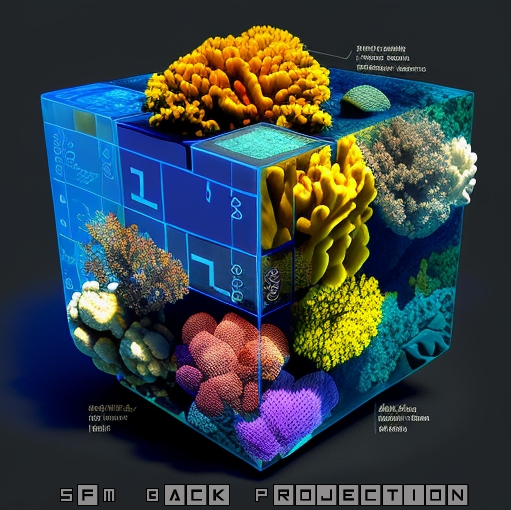

# Classifying SfM Models by Back Projecting Labels

<p align="center">
  
</p>

---

This workflow projects labels from a labeled orthomosaic (created in TagLab)
into 3D local coordinates, using the DEM as a source for the elevation. This creates a sparse 
labeled point cloud. This sparse labeled point cloud is used as training data to learn a ML 
algorithm (RandomForest, KNN, etc.,) using features such as `X`, `Y`, `Z`, `R`, `G`, `B`, and 
others that can be calculated such as the `Normals` or other geometric features. Once learned, 
the ML model applies predictions to the dense point cloud, creating a classified version. 
Additionally, if a mesh exists, the labels can be transferred to the vertices within Metashape 
by simply using the `colorize vertices` tool within Metashape, using the dense point cloud as a 
source. 

##### Below is a brief summary of the process:

1. Go through SfM workflow, creating the sparse, and the dense point cloud
2. Orient the scene, reduce the region as much as possible, and provide scale
3. Create a DEM and orthomosaic using the dense point cloud as the source (no interpolation)
4. Export the DEM and orthomosaic as .tif files; export files such that `no data` is white
5. Import orthomosaic and DEM into TagLab, label, export labels as .tif file, save json project file
6. Using the `back_project.py` script, provide paths for orthomosaic, DEM, labeled orthomosaic, and TagLab json file
7. This script will create a labeled training point cloud, and a classified dense point cloud (.ply file)
8. Import these into Metashape or any other 3D data viewing platform (e.g., VISCORE)

Please review the instructions on [Installation](./Tutorials/Installation_Guide.md), and the detailed description of 
the [Workflow](./Tutorials/Workflow.md) before attempting.

### Point Clouds

<p align="center">
  
  <br>Original Dense Point Cloud
</p>

<p align="center">
  <a href="https://www.youtube.com/embed/DdXprSApgAw">
    
  </a>
  <br>Classified Point Cloud <b>(click the video)</b>.
</p>


Both the training labeled point cloud and classified dense point cloud (.ply) contain the following:

```
`x` - coordinate, x-direction
`y` - coordinate, y-direction 
`z` - coordinate, z-direction
`r` - color component value, red 
`g` - color component value, green 
`b` - color component value, blue  
`red` - label color component value, red  
`green` - label color component value, green
`blue` - label color component value, blue
`xn` - calculated normal, x-direction
`yn` - calculated normal, y-direction 
`zn` - calculated normal, z-direction
`confidence` - model prediction for top1 class, [0 - 100] 
`class` - class index corresonding to TagLab class category / class color
```

### Label Mapping

In addition to the training and classified dense point cloud, a `Label_Mapping.json` will be output containing the 
following information. This can be use in future downstream tasks.
```
{
    "TagLab_File": "TagLab_Project_File.json",
    "Class_Categories": {
        "0": {
            "Class_Category": "Unlabeled",
            "Class_Color": [
                0,
                0,
                0
            ]
        },
        "1": {
            "Class_Category": "Acropora",
            "Class_Color": [
                255,
                255,
                0
            ]
        },
        "2": {
            "Class_Category": "Porites",
            "Class_Color": [
                0,
                255,
                0
            ]
        },
        "3": {
            "Class_Category": "Montipora",
            "Class_Color": [
                0,
                255,
                255
            ]
        }
    }
}

```

### Model Export
The model trained during the workflow will be exported to the specified output folder as a `.joblib` file. This file
can be used in future downstream tasks. For more information, see SciKit-Learn's 
[documentation](https://scikit-learn.org/stable/model_persistence.html) on model persistence.
```python
import joblib

# End of script
joblib.dump(model, args.output_path + args.model_type + "_model.joblib")

# In future script
model = joblib.load(args.output_path + args.model_type + "_model.joblib")
```

### Notes:
- Time for the workflow on a sample scene containing 68 images is ~4 minutes, start to finish; on a scene containing ~2k
  images, the workflow completes in ~45 minutes. 
- The ML algorithm chosen will affect the speed of the workflow, as well as the resulting accuracy.
- RGB color component values for the labeled training point cloud come from the imported orthomosaic.
- Label color component values come from the TagLab JSON project file.
- The `setup.py` script should be run before attempting the workflow, this will install the dependencies in 
`requirements.txt` to the Metashape python environment.
- If the labeled orthomosiac is made from an orthomosaic other than the one produced by Metashape, additional steps are 
 required. A description for this process can be found in the [VISCORE_Guide](./Tutorials/VISCORE_Guide.md).
- To use the workflow outside Metashape, use `back_project.py`; the Metashape license is expected to be stored 
in the environmental variable `METASHAPE_LICENSE`.
- This workflow was tested with Metashape version 2.0.x

### Citation

If used in project or publication, please attribute your use of this repository with the following:
    
```
@misc{SfM Back Projection,
  author = {Pierce, Jordan and Edwards, Clint and Vieham, Shay and Rojano, Sarah and Cook, 
  Sophie and Battista, Tim},
  title = {SfM Back Projection},
  year = {2022},
  howpublished = {\url{https://github.com/Jordan-Pierce/SfM_Back_Projection}},
  note = {GitHub repository}
}
```
---

### Disclaimer

This repository is a scientific product and is not official communication of the National Oceanic and Atmospheric 
Administration, or the United States Department of Commerce. All NOAA GitHub project code is provided on an 'as is' 
basis and the user assumes responsibility for its use. Any claims against the Department of Commerce or Department of 
Commerce bureaus stemming from the use of this GitHub project will be governed by all applicable Federal law. Any 
reference to specific commercial products, processes, or services by service mark, trademark, manufacturer, or 
otherwise, does not constitute or imply their endorsement, recommendation or favoring by the Department of Commerce. 
The Department of Commerce seal and logo, or the seal and logo of a DOC bureau, shall not be used in any manner to imply 
endorsement of any commercial product or activity by DOC or the United States Government.


### License 

Software code created by U.S. Government employees is not subject to copyright in the United States (17 U.S.C. §105). 
The United States/Department of Commerce reserve all rights to seek and obtain copyright protection in countries other 
than the United States for Software authored in its entirety by the Department of Commerce. To this end, the Department 
of Commerce hereby grants to Recipient a royalty-free, nonexclusive license to use, copy, and create derivative works of 
the Software outside of the United States.
