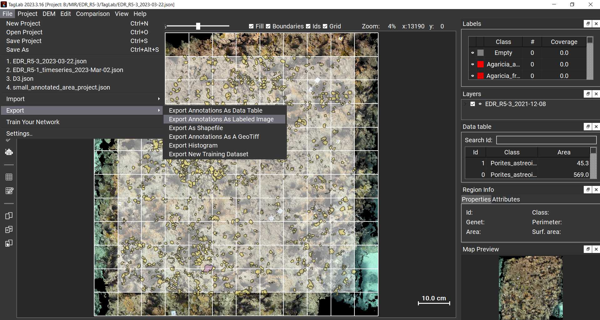

### VISCORE Guide

In certain situations, it may be desirable to create an orthomosaic from a platform other than Metashape (e.g., VISCORE). The issue with this is that orthomosaic made from Metashape and that made with VISCORE are not aligned. This means that the labeled orthomosaic made from the VISCORE mosaic in TagLab will also not be aligned, making the back projection process fail. Therefore, an additional step consisting of aligning the VISCORE / labeled mosaic is needed to work with the existing workflow.

The process is as follows:

1. Import the VISCORE mosaic into TagLab, label it, and export the Project JSON file, along with the labels as a PNG;
2. Run the `combine_viscore_metashape.py` script to create a GeoTiff containing the VISCORE mosaic (bands 1, 2, 3) and labels (bands 4, 5, 6);
3. Open ArcGIS and import the Metashape orthomosaic GeoTiff, and the combined VISCORE GeoTiff;
4. Use the Georeferencing tool to georectify the combined VISORE mosaic (source), relative to the Metashape orthomosaic (target);
5. Use the Extract Bands tool to extract bands 4, 5, and 6 from the georectified VISCORE mosaic as separate GeoTiff;
6. Use the Raster Calculator tool to create an empty 3-band raster matching the dimensions of the Metashape mosaic;
7. Use Band Mosaic tool to merge bands of the sepreated georectified VISCORE mosaic into the empty 3-band raster;
8. Export the labeled Metashape mosaic as a PNG, with the same dimensions of the Metashape orthomosaic;
9. Use this orthomosaic with the `back_project_metashape.py` script.

#### Labeling the VISCORE Orthomosaic in TagLab  

In this guide, you will be labeling the VISCORE orthomosaic in TagLab as opposed to the one created in Metashape. After installing TagLab, open the program, create a new project, import the VISCORE orthomosaic as a new map, and begin labeling. Once you have finished labeling, export the labels as an image by clicking on `File`, `Export` and then `Export Labels as Image`. This will create a PNG file containing the labels. Make sure to also save the TagLab project as a JSON file by clicking on `File`, `Save Project As...`.



#### Combining VISCORE orthomosaic and TagLab Labels  

The next step is to combine the VISCORE orthomosaic (GeoTiff) and TagLab labels (PNG). To do this, you can either use the `combine_raster_metashape.py` script in Metashape, or the `combine_rasters.py` via the command line. Open your Metashape project, click on `Tools`, and then `Scripts`. Navigate to the script in `Scripts/combined_rasters_metashape.py` and select it. This will create a new box at the top of the screen called `Combine Rasters (Metashape)`.


Selecting this box, you will then be prompted for the following:

1. The path to the VISCORE orthomosaic (GeoTiff);
2. The path to the TagLab labels (PNG).


The script will run in the background, and produce a new GeoTiff with the name of the VISCORE orthomosaic, followed by `_combined.tif`. This GeoTiff will contain the VISCORE orthomosaic as the first three bands, and the TagLab labels as last three bands. Since there are 6 bands, you will not be able to open this image in any typical photo viewer.

#### Exporting Metashape Orthomosaic and DEM  

An orthomosaic and DEM must have been created in Metashape for this workflow; if this has not been done, please refer to the [Workflow]("./Workflow.md") tutorial before continuing.

Before exporting the orthomosaic and DEM from Metashape, ensure that both are the same coordinate system as the dense point cloud. To do this, click on the `Ruler` tool in Metashape and select a location in the dense point cloud, making note of the cooridnates. Then select the same location in the orthomosaic, and the DEM. If all coordinates are the same, then they are all in the same coordinate system, otherwise, re-create the orthomosaic and DEM following instructions in the [Workflow]("./Workflow.md") tutorial before continuing.

#### Align the Combined VISCORE Mosaic  

The next step will be to align the combined VISCORE mosaic relative to the Metashape orthomosaic. This can be done in ArcGIS Pro or any other GIS software (e.g. QGIS), though the steps below are for ArcGIS.

Create a new ArcGIS project using the Map template, and import the Metashape orthomosaic, and combined VISCORE mosaic using the `add data` tool. You should see both of them in a similar area on the map (right-click on the layer and select `Zoom to Layer`) as neither is georeferenced.


Select the combined VISCORE mosaic raster layer, go to the `Imagery` tab, and select the `Georeference` tool. Use the `Move`, `Scale`, and `Rotate` tools to adjust the combined VISCORE mosaic to match that of the Metashape orthomosaic.tif as closely as possible. It does not need to be perfect, but being closely aligned makes the next step easier and more successful.


From the `Georeference` tool tab, press `Add Control Points`, and set the `Transform` to `Adjust`. From here you will first select a control point from the combined VISCORE mosaic raster layer (source), and then select the corresponding location in the Metashape orthomosaic raster layer (target). Do this multiple times, particularly in areas along the perimeter. Once you have selected enough points (10-15), you should have near pixel alignment between the two.


Once satisfied, press `Save`, and then exit the `Georeference` tool. This will save the changes you made to the combined VISCORE mosaic raster layer.


As a sanity check, you can select the `Band Combination` tool under `Raster Layer` and select bands 4, 5, and 6 to view the labels instead of the VISCORE orthomosaic. You should see the labels in the same location as the Metashape orthomosaic by altering the transparency of the layer.


#### Creating Labels for Metashape Orthomosaic  

The VISCORE labels are bands 4, 5, and 6 of the combined VISCORE mosaic raster, which have now been aligned. To create labels for the Metashape orthomosaic, we will now perform a series of operations that will result in a PNG representing the labels for the Metashape orthomosaic.

__Extract Bands 4, 5, and 6__  
First, the bands 4, 5, and 6 of the combined VISCORE mosaic raster need to be extracted. To do this, use the `Extract Bands` tool within `Raster Function`. This will open a panel, which will prompt you for an input layer (i.e., the combined VISCORE mosaic), and the bands to select. Manually type in bands `4, 5, 6` and select `OK`. This will generate another layer within in the `Contents` panel containing just those bands.


__Create Empty Metashape Orthomosaic__  
Next, create a copy of the Metashape orthomosaic raster layer, but containing only zeros; this is to mimic the unlabeled areas that would be produced in TagLab. Select the `Raster Calculator` tool, choose the Metashape orthomosaic raster layer, and in the expression box, copy and paste the following (make adjustments to the name as needed):

```python
# Expression
Con(IsNull("Metashape_Orthomosaic"),0 ,0)
```

Press `OK` and this will create a new layer in the `Contents` panel that is the same size as the Metashape orthomosaic, but contains only zeros. Note that this make take a bit of time to complete, even though the operation is fairly simple.


__Mosaic Bands__  
The next step is to combine the extracted VISCORE labels with the zeros in the Metashape orthomosaic raster layer. To do this, select the `Mosaic Bands` tool within `Raster Functions`, select the two raster layers created in the previous steps, and select `max` as the method for joining the two layers. Press `OK`, and when it has completed, there should be another layer representing the VISCORE labels, but with dimensions that match the Metashape orthomosaic.


This should create another raster layer in the Content Panel (be sure to wait until it's finished), that is aligned with the original Metashape orthomosaic raster layer, but contains all 0's except for the labeled regions.


__Export Metashape Labels__  
Finally, export the Metashape labels by right-clicking on the layer in the `Contents` Panel, going down to `Data`, and selecting `Export Data`. Click the parameters shown below, ensuring that coordinate system is the same as the Metashape orthomosaic, the file is saved as a `PNG`, and that the dimensions match that of the Metashape orthomosaic.


#### Back Projection Workflow

You have completed the necessary steps; for the remainder of the Back Projection workflow, you will use this newly create Metashape Labels (PNG) with the `back_projection_metashape.py` script when prompted. Please return to the [`Workflow`](./Workflow.md) tutorial to continue.


```python

```
