### SfM Back Projection Workflow

This notebook is a demonstration of the SfM back projection workflow using an ungeoreferenced scene. The workflow can be used to create a sparse labeled point cloud, which can be used for training a machine learning model, and also a classified dense point cloud, useful for calculating structural complexity metrics in 3D. The workflow can be performed within Metashape using the script `back_projection_metashape.py`, or using the command line interface with `back_projection.py`. This workflow was designed to be easy to use, to minimize the amount of manual work required, and deviations away from the standard SfM workflow typically used by benthic ecologists.

For the workflow to work, the following are required:
- A sparse point cloud, created in Metashape;
- A dense point cloud, created in Metashape;
- A digital elevation model (DEM) of the dense point cloud, created in Metashape;
- An orthomosaic of the dense point cloud (using the DEM), in Metashape;
- A labeled version of the orthomosaic, created in TagLab.

Before starting the workflow, it is necessary to install all of the required dependencies. To do this, please read the [`Installation_Guide.ipynb`](./Installation_Guide.ipynb) notebook.

#### Typical SfM Workflow

The first portion of this workflow follows the typical SfM workflow used by many benthic ecologists, which includes the following steps:
1. Import images into Metashape;
2. Align images;
3. Optimize camera alignment;
4. Build dense cloud;
5. Orient the scene, reduce region, add scale;
6. Build a DEM from the dense cloud, export;
7. Build an orthomosaic from DEM, export.

Steps 1 - 5 can be performed as one usually would, where steps 6 - 7 require minor attention. Below is brief description assuming the completion of steps 1 - 4.

#### Resize Region

To reduce unnecessary processing time, it is recommended to reduce the region of the scene to the area of interest. To do this, click on `Tools`, `Resize Region`, and select the region of interest. This will reduce the region of the scene to the area of interest, and will also reduce the processing time of the workflow. If your scene is not oriented correctly you will also need to make these corrections such that pressing the 1 and 3 keys will give you different side views, and pressing the 7 key will give you a top-down view.

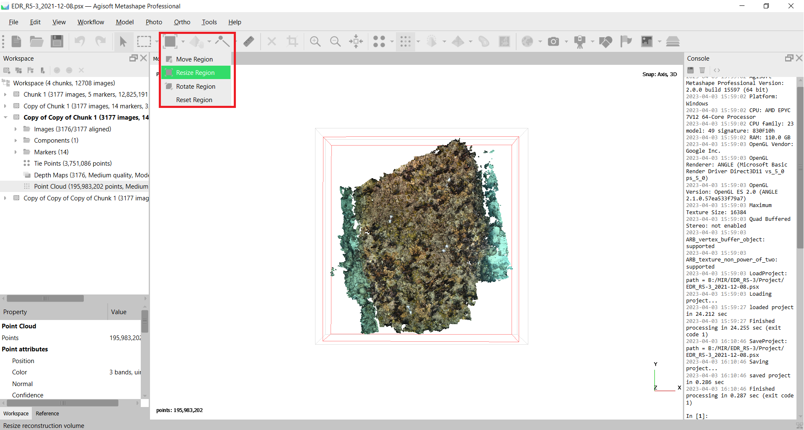

#### Build a DEM from the dense cloud

Click on `Workflow`, `Build DEM`, and choose the following settings. The DEM should be made from the Dense Point Cloud, with the coordinate system set to either `Geographic`, if georeferencing was provided to the scene, or `Planar` using a `Top XY` perspective otherwise. A criteria of the DEM and orthmosaic is that they need to be in the same coordinate system of the Dense Point Cloud (more on this later). `Interpolation` can be disabled as those values will not be used. Finally, make note of the region the DEM will be built for, as this will be used later and is typically the source of any issues that may arise during the workflow.

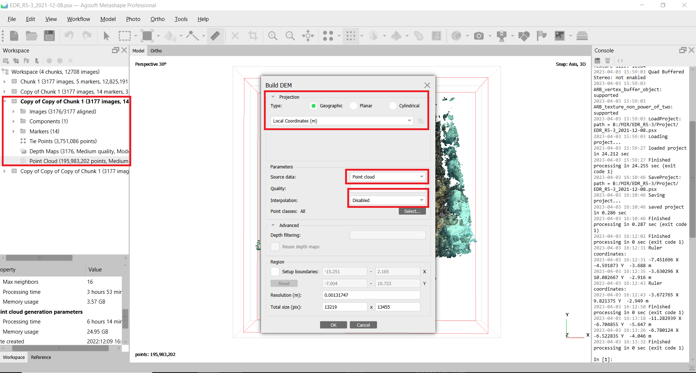

One the DEM has been created, perform a sanity check to ensure that the coordinate system of the DEM is the same as the Dense Point Cloud. If they are not, the workflow will not work. To check this, open the DEM in Metashape and click on the `Ruler` tool. Click on locations within the DEM, and confirm those same locations in the Dense Point Cloud return roughly the same coordinates (these can be seen in the `Console`). If they do not, the DEM needs to be rebuilt with the same coordinate system as the Dense Point Cloud.

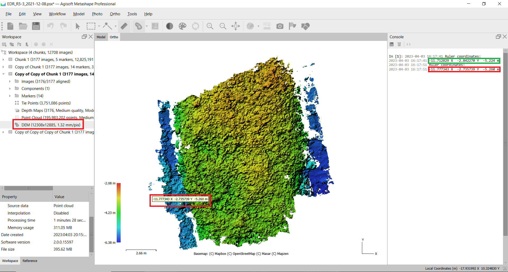

In the above figure, a location in the DEM has been selected (red), which corresponds to the same location in the Dense Point Cloud (green). The coordinates of the two locations are also shown in the `Console`.

#### Export the DEM

Export the DEM by right-clicking on the DEM in the `Chunk` window, and selecting `Export`. The DEM will be exported as a .tif file, with the default `no-data` value being unchanged (-32767). Before exporting, ensure that the export DEM's dimensions match that of the DEM in Metashape (red boxes); if these are not the same, adjust the values so that they are. Having inconsistency between the two will cause an error to arise later in the workflow. Choose these settings, and export the DEM.

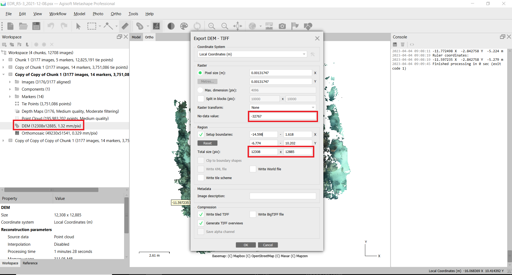

#### Build an orthomosaic from DEM

Next, build an orthomosaic by clicking on `Workflow`, `Build Orthomosaic`. In the panel, select the DEM as the surface source for elevation, and make note of the region the orthomosaic will represent. Again, if the orthomosaic does not match the region of the DEM and Dense Point Cloud, an error will arise later in the workflow. Pres `OK` to build the orthomosaic.

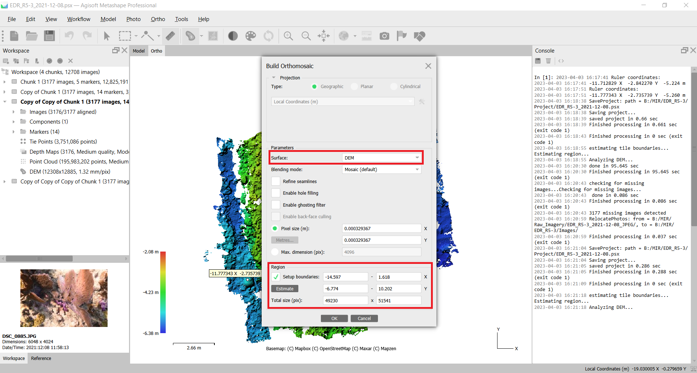

Perform another sanity check to ensure that the newly created orthomosaic matches the region of the DEM and Dense Point Cloud by selecting the `Ruler` tool and clicking on locations within the orthomosaic. These locations should correspond to the same locations in the DEM and Dense Point Cloud. If they do not, the orthomosaic needs to be rebuilt with the same region as the DEM and Dense Point Cloud.

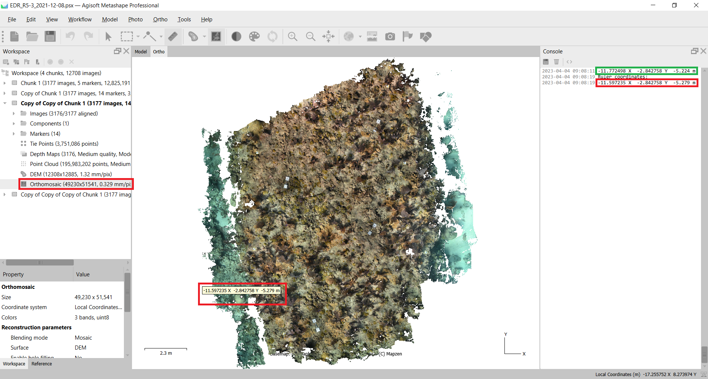

In the figure above, the same location in the orthomosaic (red) corresponds to the same location in the DEM (green) and Dense Point Cloud (green). The coordinates of the three locations are also shown in the `Console`.

#### Export the Orthomosaic

Export the orthomosaic by right-clicking on the orthomosaic in the `Chunk` window, and selecting `Export`. The orthomosaic will be exported as a .tif file. Ensure that the default `Background color` is set to `white`. Before exporting, ensure that the export orthomosaic's dimensions matches that of the orthomosaic in Metashape (red boxes); if these are not the same, adjust the values so that they are. Having inconsistency between the two will cause an error to arise later in the workflow. Choose these settings, and export the orthomosaic.

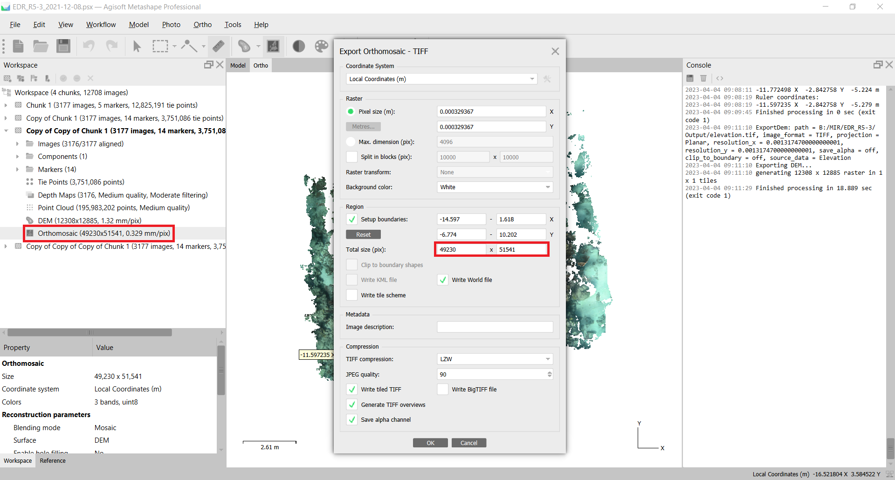

#### Labeling the Orthomosaic with TagLab

The next step is to label the orthomosaic: this workflow recommends using [`TagLab`](github.com/TagLab). TagLab is a free, open-source tool for labeling orthomosaics of coral reefs, and includes many machine learning assistance tools to expedite the process. Other tools can be used to label the orthomosaic, though they will not be discussed here. Some users will already have labeled an orthomosaic made using a different software other than Metashape (i.e, VISCORE); this is fine, however the workflow still requires the above steps to be completed. For these users, please see the [`VISCORE_Guide.ipynb`](./VISCORE_Guide.ipynb) notebook for instructions on how to convert your labeled VISCORE orthomosaic to a format that can be used in this workflow.

Once TagLab has been installed, open the program, create a new project, and import the orthomosaic as a map. Use any of the tools to assist you in labeling the orthomosaic. Once the orthomosaic has been labeled, you will need to export the labels as an image; to do this, click on `File`, `Export`, and then `Export labels as an image`. This will create a .png file representing the labels of the orthomosaic. If you open this file, you will see that all non-labeled areas are black, and all labeled areas are the colors you assigned to them in TagLab. You should also notice the dimensions of the .png file, and they match the dimensions of the orthomosaic .tif file. This is the format that the workflow requires.

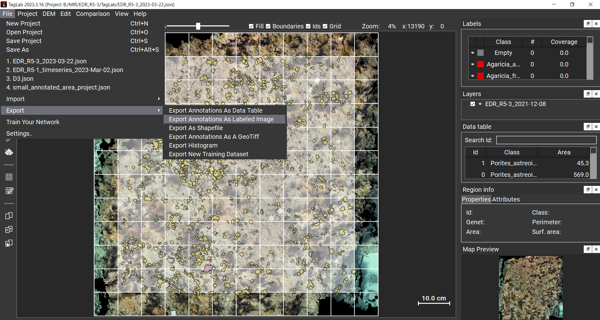

Before closing TagLab, ensure that you save the project and know the location of the project file (.json). This will be needed later in the workflow.

#### Back Projection in Metashape

The next step is back project the labels made for the orthomosaic in TagLab to create a sparse labeled point cloud, and a classified dense point cloud. This step is performed in Metashape, and is automated through a script. The script is located in the `Scripts` folder of this repository, and is called `back_projection_metashape.py`; a version that can be run via command line is also provided (`back_projection.py`). Before starting this process, ensure the following:

- The dependencies for the script are installed (see [`Installation_Guide.ipynb`](./Installation_Guide.ipynb) for more information);
- The location of the exported orthomosaic (.tif);
- The location of the exported DEM (.tif);
- The location of the labeled orthomosaic (.png);
- The location of the TagLab project (.json).

Open your Metashape project, click on `Tools` and select `Scripts`; this will provide a window where you can select the `back_projection_metashape.py` script.

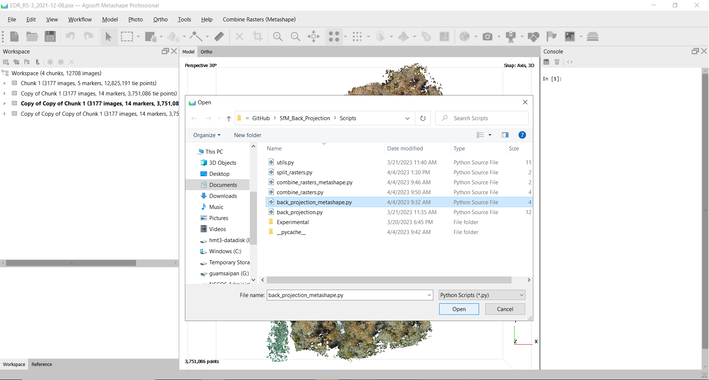

Once the script has been selected, a new box will appear at the top of your Metashape window called `Back Projection (Metashape)`. First click on the Chunk you are working on to active it, and then select the `Back Projection (Metashape)` box. This will open a new window where you can input the locations of the files mentioned above and the folder to output the results to. You will also be asked to select the following:

__The sample percentage of labeled indices in the labeled orthomosiac__  
This represents the amount of labeled indices to select from the labeled orthomosaic. The higher the percentage, the more labeled indices will be selected. The lower the percentage, the less labeled indices will be selected. The default value is 1.0, meaning all the labeled indies. This value can be changed to any value between 0 and 1.0.

__The sample percentage of non-labeled indices in the labeled orthomosiac__  
This represents the amount of non-labeled indices to select from the labeled orthomosaic. The higher the percentage, the more non-labeled indices will be selected. The lower the percentage, the less non-labeled indices will be selected. The default value is 0.01, meaning 1% of the non-labeled indies. This value can be changed to any value between 0 and 1.0. For labeled orthomosaics with a large amount of non-labeled indices, it's best to keep the default value, otherwise the machine learning algorithm will be heavily biased towards the non-labeled indices.

__The down sample percentage of the dense point cloud__  
This represents the amount of points to select from the dense point cloud. The higher the percentage, the more points will be selected. The lower the percentage, the less points will be selected. The default value is 1.0, meaning all the points. This value can be changed to any value between 0 and 1.0. This parameter value is made available to the user, as some computers may not have enough memory (RAM) to handle the entire point cloud. If you experience an error during the back projection process, try reducing this value.

__The machine learning algorithm__  
This workflow currently uses [`Scikit-Learn`](https://scikit-learn.org/stable/) to perform the machine learning. The default algorithm is `Random Forest`, but other algorithms can be used. The available algorithms are:
- `Random Forest`: `rf`
- `Support Vector Machine`: `svm`
- `K-Nearest Neighbors`: `knn`
- `Multilayer Perceptron`: `mlp`

Note that all of these machine learning algorithms are relatively simple, and use the default parameters; it is also recommended to not use `Support Vector Machine`, as it is terribly slow. If you wish to use a different machine learning algorithm, you will need to modify the function `utils/create_classifer`. The features the machine learning algorithms use are the following:

- `x`: the x coordinate of the point;
- `y`: the y coordinate of the point;
- `z`: the z coordinate of the point;
- `x normal`: the x component of the normal vector of the point;
- `y normal`: the y component of the normal vector of the point;
- `z normal`: the z component of the normal vector of the point;

Additional features can be calculated and added to the function `utils/calculate_features` if desired.

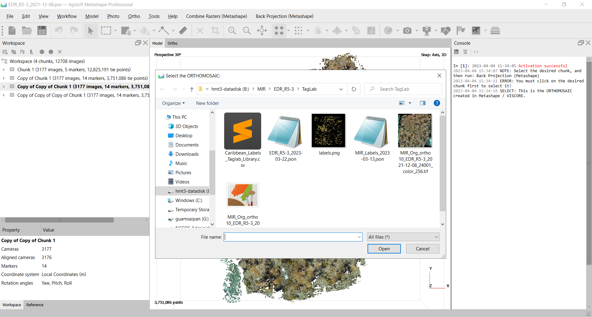

Once selecting all of the parameters, the script will run in the background and log the results to the `Console`. It is recommended to not to interact with Metashape while the script is running. Once the script has finished, the results will be saved to the output folder you specified. The results will include the following:

- Exported Dense Point Cloud (.ply)
- Exported Sparse Labeled Point Cloud (.ply)
- Exported Classified Dense Point Cloud (.ply)
- Label Mapping (.json)
- Model (.joblib)

The two point clouds will be imported into the currently active Chunk within Metashape automatically at the end of the script.

#### Viewing the Classified Dense Point Cloud

Both the Sparse labeled point cloud used for training, and the classified dense point cloud can be viewed within Metashape. To view the classified dense point cloud, open the `Chunk` window, and select the `Classified Dense Point Cloud` layer. This will display the classified dense point cloud in the `3D View` window. The colors of the classified dense point cloud will correspond to the label color assigned in TagLab.

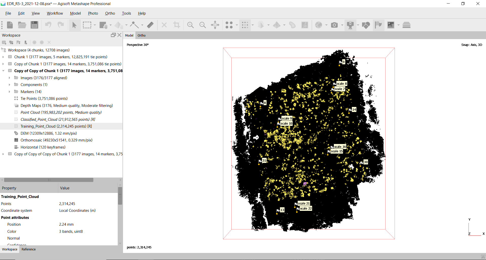

Each of the labeled point clouds will also include confidence scores that can be used to filter the point cloud. To do this, click on `Tools`, `Dense Point Cloud`, and select `Filter by Confidence`. Typically, the confidence values represent a level of certainty that Metashape assigns representing the accuracy of the constructed point. However, for the labeled point clouds, these values are overwritten to represent the model's confidence (i.e., top-1 choice). The confidence values are stored in the point clouds between [0 - 100], where 100 represent high confidence. All values in the sparse labeled point cloud will be 100, and all values in the classified dense point cloud will be between 0 and 100.

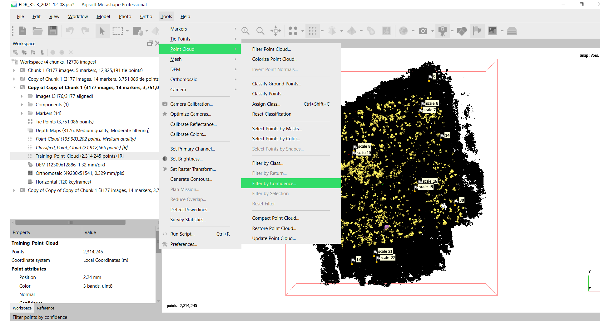


#### Downstream Tasks

As mentioned in the `README', the point clouds (.ply files) contain the following information for each point:  

`x` - coordinate, x-direction  
`y` - coordinate, y-direction  
`z` - coordinate, z-direction  
`r` - color component value, red  
`g` - color component value, green  
`b` - color component value, blue  
`red` - label color component value, red  
`green` - label color component value, green  
`blue` - label color component value, blue  
`xn` - calculated normal, x-direction  
`yn` - calculated normal, y-direction  
`zn` - calculated normal, z-direction  
`confidence` - model prediction for top1 class, [0 - 100]  
`class` - class index corresonding to TagLab class category / class color  

These values can be used in additional downstream tasks, including calculating structural complexity metrics per class category, or training larger machine learning algorithms on multiple labeled/classified point clouds. To assist with this, the script also outputs a `Label_Mapping.json` that provides a mapping between the class index within the point clouds, the label color, and the assigned scientific name.

#### Issues

If you encounter any issues, please submit an `issue` on the GitHub repository.


```python

```
